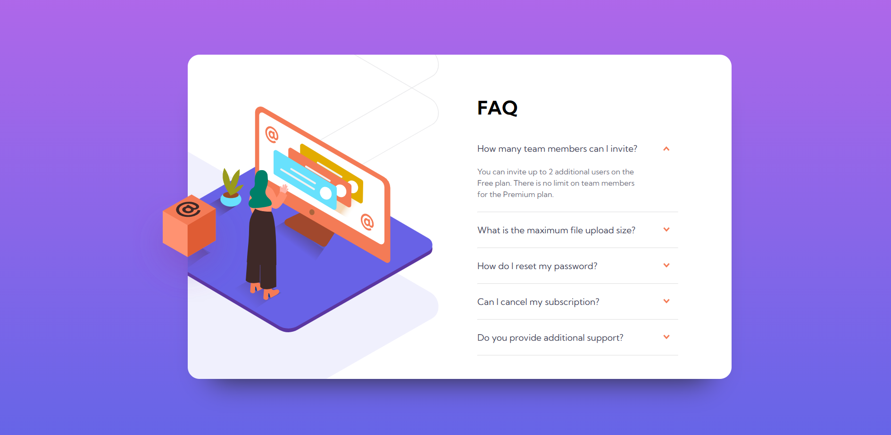

# Frontend Mentor - FAQ accordion card solution

This is a solution to the [FAQ accordion card challenge on Frontend Mentor](https://www.frontendmentor.io/challenges/faq-accordion-card-XlyjD0Oam).

## Table of contents

- [Overview](#overview)
  - [Screenshot](#screenshot)
  - [Links](#links)
- [My process](#my-process)
  - [Built with](#built-with)
  - [What I learned](#what-i-learned)
- [Author](#author)


## Overview

### Screenshot



### Links

- Solution URL: [https://jefferh30.github.io/FAQ-accordion-card/](https://jefferh30.github.io/FAQ-accordion-card/)
- Live Site URL: [https://jefferh30.github.io/FAQ-accordion-card/](https://jefferh30.github.io/FAQ-accordion-card/)

## My process

### Built with

- Semantic HTML5 markup
- CSS custom properties
- Flexbox
- CSS hover states
- Simple JavaScript

### What I learned

- Practiced the use of Flexbox and semantic HTML.
- Used forEach to add an event listener for each toggle
- Used CSS Transform to rotate arrow when toggling

```html
<main>Inserted the FAQ component here</main>
<footer>Inserted attribution here</footer>
```
```css
.question-heading{
    display: flex;
    justify-content: space-between;
    align-items: center;
    cursor: pointer;
}
```

```js
questionHeadings.forEach((heading) => {
  heading.addEventListener('click', () => {
    // toggle the display property of the content element
    if (content.style.display === "block") {
      content.style.display = "none";
    } else {
      content.style.display = "block";
    }
  }}
```

## Author

- Website - [Jefferson Huera](https://www.neurochispas.com)
